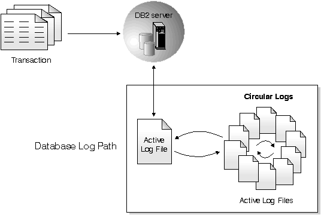

# Query logging in application framework

This repository contains team project from subject _PA036 Database System Project_

# PA036 Project team
* Kundrát, Vladimír(409764)
* Gdovin, Filip(410328)
* Baranová, Zuzana(422364)
* Kamil Triščík(410030)

Project uses business layer from PA165 Java project SEM. 

#### Basic app logging info ####
##### Postgres DB #####
Before using application is required to:
* turn on **log_collector** - runtime configuration options reload not enough, required DBS restart
* set **log_directory**, **log_filename**, **log_filemode** - necessary to set valid file/directory owner/group permissions to postgres admin user
* set DB connection settings in **(test)database.properties** file on **logging-persistence** module.
* set logging options in **loggingConfig.properties** file on **logging-utils** module.

More postgres logging details [here](https://www.postgresql.org/docs/current/static/runtime-config-logging.html).
**DDL** and **MOD** scripts are present in resources of **logging-utils** module.
# SEM

Team project of _PA165 Enterprise Applications in Java_

# Project information
More information about our project you can find in [project Wiki](https://bitbucket.org/KamilTriscik/sem/wiki/Home)

# Former PA165 SEM team
* Matej Majdiš(410246)
* Veronika Aksamitová(410280)
* Vít Hovězák(359488)
* Kamil Triščík(410030)

# How to use application
#### How to run application ####
1. `git clone https://github.com/kamil-triscik/PA036.git`
2. `cd logging`
3. `mvn clean install`
3. `cd logging-mvc`
4. `mvn tomcat7:run` - in case of default port **8081** it`s not available, in _pom.xml_ on line 171 set another available port
5. application is available on `http://localhost:8081/pa036`

#### How to login ####
* **As super manager**
    * **Login**: _kamil@example.com_(for example)
    * **Password**: _supersilneheslo_
    
* **As basic user**
    * You can use **registration**
